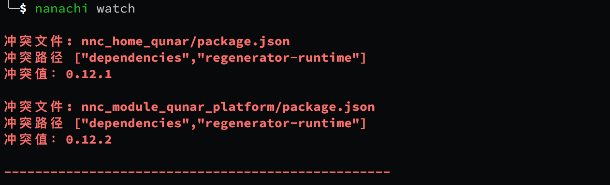

# 拆库开发

拆库开发亦称分仓库开发。

## 拆库开发能解决哪些问题？

想象一下，如果一个小程序非常大，比如说商场小程序，有许多频道，这涉及多条业务线，每条业务线有自己的开发一个频道。

如果没有拆库功能，本地开发时，需要将整个工程全量 clone 到本地然后进行开发。

一旦项目体量大起来（业务线多起来），上面这种方式很容易不小心误触别业务线的代码，并且全量编译的时间更长，效率低。

在开发时：
1. 如何能让自己业务线代码保持独立，只专注于本业务线代码？
2. 如何自由安装在开发中所依赖的其他业务线代码呢？
<br>

这，就是 nanachi 拆库开发所要解决的问题。


## 如何对代码进行拆库？

我们允许每个业务线都独立建一个github/gitlab仓库进行独立开发，**每个仓库需要保持 nanachi 工程所必须的目录结构（这是必须的）**。

下面是某一个业务线的 source 目录结构, 由于它不是主包，因此没有app.js, 改成包含合并指令的app.json

强烈建议看一下[别名机制](./alias.md)

```
  source
    |--components //合并到主包的组件
    |--assets     //合并到主包的静态资源
    |--common     //合并到主包的公用方法
    |--pages
    |    |--commponents //留在分包的组件
    |    |--assets      //留在分包的静态资源
    |    |--common      //留在分包的组件
    |    |--page1
    |    |--page2
    |    |--page3
    |    |--page4
    |    └── ...
    |--app.json (不存在app.js)
  package.json

```

业务线的 package.json 需要进行简单配置
```json
{
  "nanachi": {
    "chaika_mode": true //这是告诉 nanachi，当前快发模式为“拆库”模式。
  }
}
```


app.json 里面有

```json
{
    "pages": [
        "pages/plat/pageA/index",
        "pages/plat/pageB/index"
    ],
    "nanachi":{
        "alias": {
            "@hotel/common": "source/common/hotel"
        }
    },
    "order": 100
}
```
- pages 字段为数组，pages 里面的路由将会被注入到 app.js 中，用以被 nanachi 编译。
- nanachi 字段即为 package.json 中的 nanachi 的配置，会被合并到 package.json 中。
- order 字段为路由排序标识，order值越大，最后打包到app.json中的这些路由排序越靠前。

## 如何使用 nanachi 拆库
1. clone 你自己的业务线代码: `git clone git@xxx.git`

2. 如果需要安装其他业务线(跟git clone一回事): `nanachi install git@otherProject.git -b branchName`
   
3. nanachi watch

## 注意事项
1. 配置文件，如wxConfig.json，aliConfig.json, ..., app.json需要放在拆库工程的**source**目录下, project.config.json, package.json等需要放在拆库工程**根目录下**。
2. nanachi拆卡模式对各配置文件合并时，nanachi会将冲突暴露。如果遇到配置冲突，需用户自行解决冲突。
   


