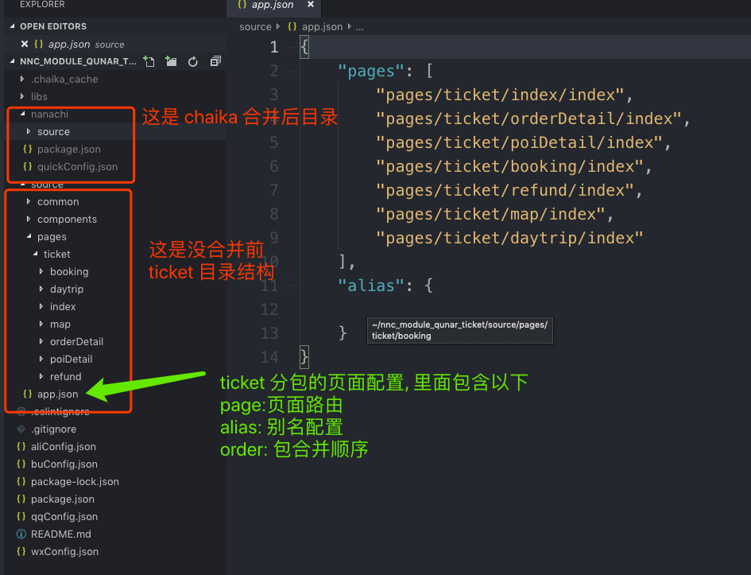

# 拆库开发

拆库开发亦称分仓库开发， 如果一个小程序非常大，比如说商场小程序，有许多频道，这涉及多条业务线，每条业务线开发一个频道，那么就需要此功能。

我们允许每个频道都独立建一个github/gitlab仓库进行独立开发
上线前，通过我们的拆包工具**chaika**， 将要上线的频道整合成一个要上线的小程序，集中用nanachi进行转译发布。

 [https://qunarcorp.github.io/chaika/](https://qunarcorp.github.io/chaika/)


 下面是某一个子频道的目录结构， 由于它不是主包，因此没有app.js, 改成包含合并指令的app.json

 强烈建议看一下[别名机制](./alias.md)

```
 src
   |--components //合并到主包的组件
   |--assets     //合并到主包的静态资源
   |--common     //合并到主包的公用方法
   |--pages
   |    |--commponents //留在分包的组件
   |    |--assets      //留在分包的静态资源
   |    |--common      //留在分包的组件
   |    |--page1
   |    |--page2
   |    |--page3
   |    |--page4
   |    └── ...
   |--app.json (不存在app.js , wxConfig.json, quickConfig.json)
```

app.json里面有

```json
{
    "pages": [],
    "nanachi":{
        "alias": {
            "@hotel/common": "source/common/hotel"
        }
    }
}
```



