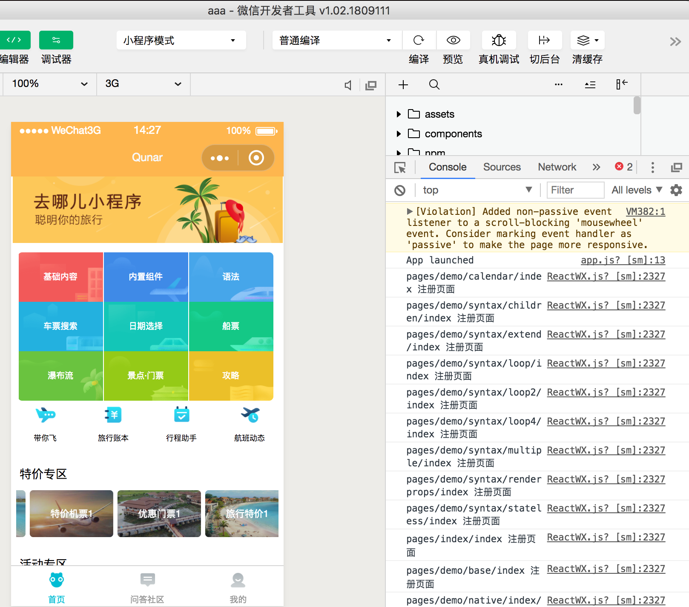
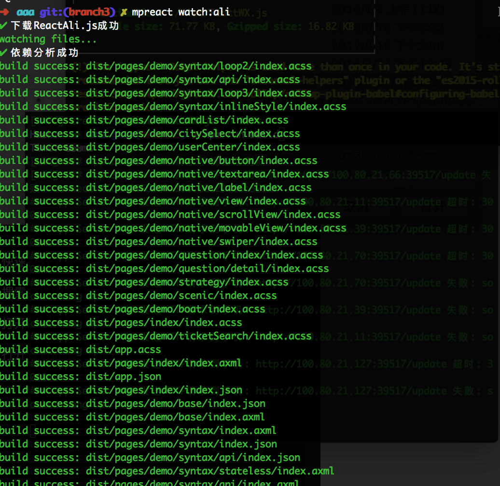
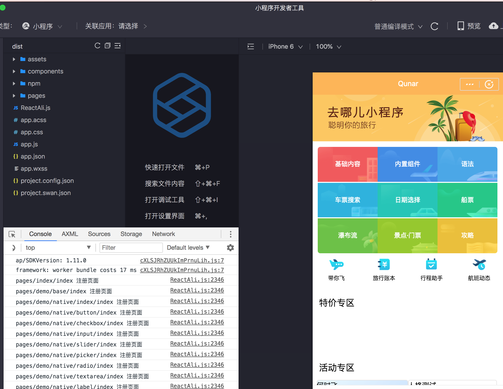
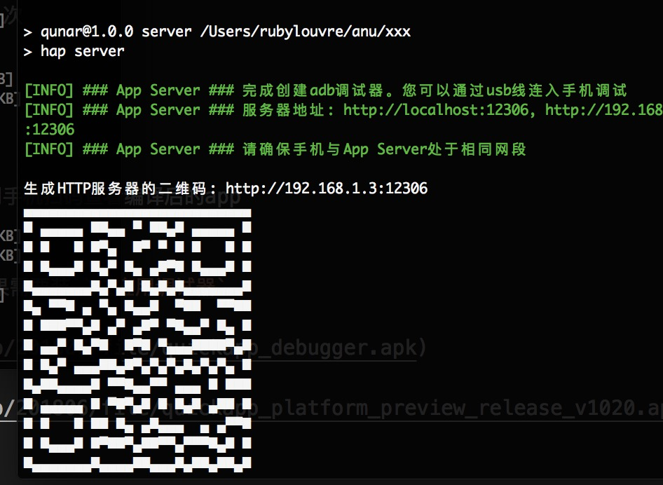

# 快速开始

## 前置要求

* 下载并安装微信开发者工具
* 本地 `Node.js` 版本 `8.0` 以上

## 微信/支付宝/百度的安装流程， 快应用见下方

1. `git clone git@github.com:RubyLouvre/anu.git` 或`git clone https://github.com/RubyLouvre/anu.git`<br /> 注意想支持支付宝/百度/快应用，请使用branch3 分支，正忙着业务线，以后会合并到master
2. 命令行定位到`packages/cli`目录下，执行`npm link` 如果之前装过要先npm unlink<br />
3. 然后定位到外面的目录，不要在cli目录中建工程。 使用 `cd ../../ && mpreact init demo` 创建工程<br />
4. 定位到 `demo` 目录下安装依赖`npm i `或`yarn`
5.  `mpreact build` 全量编译代码，build后面可跟参数， 如mpreact build:ali<br />
6.  `mpreact watch` 增量编译代码并监听文件变化，watch后面可跟参数<br />
7. 用微信开发工具打开当中的dist目录，自己在source目录中进行开发<br />

```bash
cd anu/packages/cli && npm link
cd ../../ && mpreact init demo
cd demo && yarn
mpreact watch   //或 mpreact watch:wx 或 mpreact watch:bu 或 mpreact watch:ali
```








有远程请求的页面，需要打开右上角 “>>” 详情，  `不校验合法域名、web-view（业务域名）、TLS 版本以及 HTTPS 证书` 打上勾


## 快应用的安装流程

执行以下命令：

```bash
npm install -g hap-toolkit //安装快应用的hap编译器， 只需安装一次
mpreact init xxx     // 初始化工程
cd xxx && npm i      // npm i可以改成yarn， 安装nanachi的依赖
mpreact watch:quick  // 编译代码
npm i                // 这是安装快应用的编译器hap的依赖，
npm run build        // 这是hap 的构建命令
npm run server       // 这是hap 的打开远程服务，生成二维码让你用手机扫码查看编译后的app
```
。
快应用还没有像微信， 支付宝， 百度那样提供好用的开发者工具，想查看结果需要手机装 `快应用调试器`。快应用只能用于安卓。

[快应用调试器](https://statres.quickapp.cn/quickapp/quickapp/201806/file/quickapp_debugger.apk)

[快应用预览版](https://statres.quickapp.cn/quickapp/quickapp/201806/file/quickapp_platform_preview_release_v1020.apk)

快应用的目标代码分别在src（ux文件）与dist（二进制）



